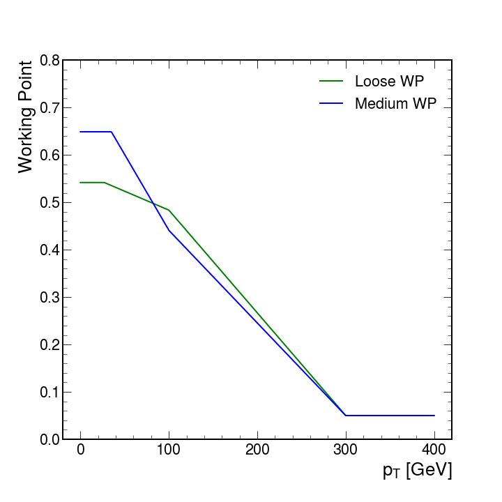

7.**HLT_DoubleMediumDeepTauPFTauHPS35_eta2p1**

**L1 seed**: `pDoublePuppiTau52_52`

- [pDoublePuppiTau52_52](../Phase2Menu_Legacy/DoublePuppiTau5252.html) : select two Taus (`CL2Taus`) with $p_T>52$ GeV - *[Table](../Tables/pDoublePuppiTau52_52.md)*

**HLT filters**:

- [hltPreDoublePFTauHPS](../Phase2Menu_Legacy/hltPreDoublePFTauHPS.html):  
prescaler with `offset = cms.uint32(0)`

    * **NOTE**: Does this have a real effect?

- [hltHpsSelectedPFTausTrackFinding](../Phase2Menu_Legacy/hltHpsSelectedPFTausTrackFinding.html):  
`cut = cms.string('pt > 0'),
discriminator = cms.InputTag("hltHpsPFTauTrackFindingDiscriminator"),
selectionCut = cms.double(0.5),
src = cms.InputTag("hltHpsPFTauProducer")` 

I assume it looks for a track matching the Tau within $\Delta R = 0.5$

- [hltHpsPFTauTrack](../Phase2Menu_Legacy/hltHpsPFTauTrack.html):  
select single HPS Tau (`hltHpsPFTauProducer`) with no $p_T$ cut, with $-1<\eta<2.5$ and `triggerType=84`.

    * **NOTE**: The minimum eta value is correct: when it is negative, the condition is not applied. 

    * **NOTE**: Are we selecting only one tau? The path indicates two taus.

- [hltHpsSelectedPFTausMediumDitauWPDeepTau](../Phase2Menu_Legacy/hltHpsSelectedPFTausMediumDitauWPDeepTau.html):  
`cut = cms.string('pt > 35 && abs(eta) < 2.1'),
discriminator = cms.InputTag("hltHpsPFTauDeepTauProducer","VSjet"),
workingPoints = cms.vstring('double t1 = 0.649, t2 = 0.441, t3 = 0.05, x1 = 35, x2 = 100, x3 = 300; if (pt <= x1) return t1; if (pt >= x3) return t3; if (pt < x2) return (t2 - t1) / (x2 - x1) * (pt - x1) + t1; return (t3 - t2) / (x3 - x2) * (pt - x2) + t2;'),
src = cms.InputTag("hltHpsPFTauProducer")`

I assume it looks for Tau with 0.5 relative isolation

    | $p_T$ value           | DeepTauVSjet Medium WP                                |
    |-----------------------|-------------------------------------------------------|
    | $p_T\leq35$ GeV       | 0.649                                                 |
    | $35<p_T<100$ GeV      | 0.649 + (0.441 - 0.649) / (100 - 35) * ($p_T$ - 35)   |
    | $100p_T<300$ GeV      | 0.441 + (0.05 - 0.441) / (300 - 100) * ($p_T$ - 100)  |
    | $p_T\geq300$ GeV      | 0.05                                                  |

<figure markdown="span">
  { width="500", align=left }
</figure>

    * **NOTE**: Why is the Medium WP at a lower level than the Loose WP for $p_T$ around 100 GeV ?

- [hltHpsDoublePFTau35MediumDitauWPDeepTau](../Phase2Menu_Legacy/hltHpsDoublePFTau35MediumDitauWPDeepTau.html):  
select two HPS Taus (`hltHpsSelectedPFTausMediumDitauWPDeepTau`) with $p_T>35$ GeV, with $-1<\eta<2.1$ and `triggerType=84`

    * **NOTE**: The maximum eta value goes from 2.5 to 2.1, since the tau reconstruction in Phase 1 is based on tracking information. This should be changed for Phase 2 to extend the taus up to the HGCAL coverage.