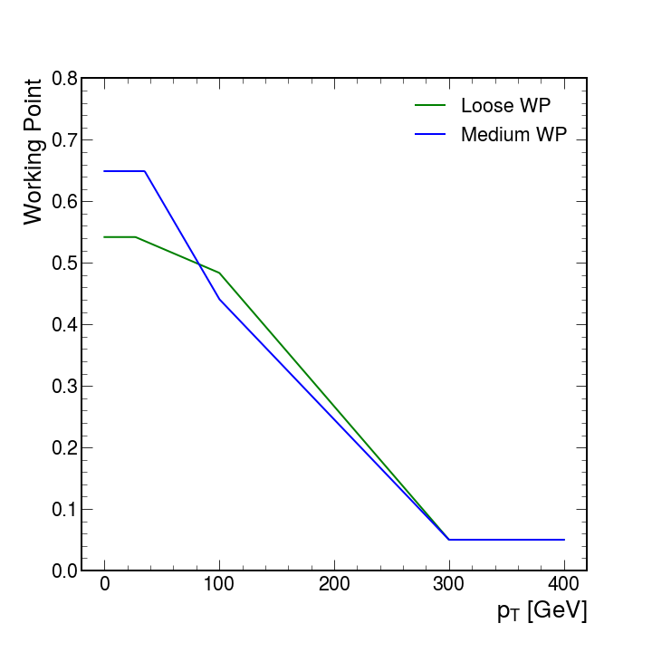

14.**HLT_Ele30_WPTight_L1Seeded_LooseDeepTauPFTauHPS30_eta2p1_CrossL1**

**L1 seed**: `pPuppiTauTkIsoEle45_22'

- [pPuppiTauTkIsoEle45_22](../Phase2Menu_Legacy/PuppiTauTkIsoEle4522.html) : select one Tau (`CL2Taus`) with $p_T>45$ GeV and EGamma (`CL2Electrons`) with $p_T>22$ GeV - *[Table](../Tables/pPuppiTauTkIsoEle45_22.md)*

**HLT filters**:

- [hltEgammaCandidatesWrapperL1Seeded](../Phase2Menu_Legacy/hltEgammaCandidatesWrapperL1Seeded.html):  
select `hltEgammaCandidatesL1Seeded` with isolation condition

- [hltEG30EtL1SeededFilter](../Phase2Menu_Legacy/hltEG30EtL1SeededFilter.html):  
select one (`ncandcut=1`) `hltEgammaCandidatesL1Seeded` object with $p_T>30$ GeV (same threshold in EB and EE)

- [hltEle30WPTightClusterShapeL1SeededFilter](../Phase2Menu_Legacy/hltEle30WPTightClusterShapeL1SeededFilter.html):  
`varTag = cms.InputTag("hltEgammaClusterShapeL1Seeded","sigmaIEtaIEta5x5")`

- [hltEle30WPTightClusterShapeSigmavvL1SeededFilter](../Phase2Menu_Legacy/hltEle30WPTightClusterShapeSigmavvL1SeededFilter.html):  
`varTag = cms.InputTag("hltEgammaHGCALIDVarsL1Seeded","sigma2vv")`

- [hltEle30WPTightClusterShapeSigmawwL1SeededFilter](../Phase2Menu_Legacy/hltEle30WPTightClusterShapeSigmawwL1SeededFilter.html):  
`varTag = cms.InputTag("hltEgammaHGCALIDVarsL1Seeded","sigma2ww")`

- [hltEle30WPTightHgcalHEL1SeededFilter](../Phase2Menu_Legacy/hltEle30WPTightHgcalHEL1SeededFilter.html):  
`varTag = cms.InputTag("hltEgammaHGCALIDVarsL1Seeded","hForHOverE")`

- [hltEle30WPTightHEL1SeededFilter](../Phase2Menu_Legacy/hltEle30WPTightHEL1SeededFilter.html):  
`varTag = cms.InputTag("hltEgammaHoverEL1Seeded")`

- [hltEle30WPTightEcalIsoL1SeededFilter](../Phase2Menu_Legacy/hltEle30WPTightEcalIsoL1SeededFilter.html):  
`varTag = cms.InputTag("hltEgammaEcalPFClusterIsoL1Seeded")`

- [hltEle30WPTightHgcalIsoL1SeededFilter](../Phase2Menu_Legacy/hltEle30WPTightHgcalIsoL1SeededFilter.html):  
`varTag = cms.InputTag("hltEgammaHGCalLayerClusterIsoL1Seeded")`

- [hltEle30WPTightHcalIsoL1SeededFilter](../Phase2Menu_Legacy/hltEle30WPTightHcalIsoL1SeededFilter.html):  
`varTag = cms.InputTag("hltEgammaHcalPFClusterIsoL1Seeded")`

- [hltEle30WPTightPixelMatchL1SeededFilter](../Phase2Menu_Legacy/hltEle30WPTightPixelMatchL1SeededFilter.html):  
Match the EGamma clusters in calorimeters to pixel tracks with `npixelmatchcut = cms.double(1.0)`

- [hltEle30WPTightPMS2L1SeededFilter](../Phase2Menu_Legacy/hltEle30WPTightPMS2L1SeededFilter.html):  
`varTag = cms.InputTag("hltEgammaPixelMatchVarsL1Seeded","s2")`

- [hltEle30WPTightGsfOneOEMinusOneOPL1SeededFilter](../Phase2Menu_Legacy/hltEle30WPTightGsfOneOEMinusOneOPL1SeededFilter.html):  
`varTag = cms.InputTag("hltEgammaGsfTrackVarsL1Seeded","OneOESuperMinusOneOP")`

- [hltEle30WPTightGsfDetaL1SeededFilter](../Phase2Menu_Legacy/hltEle30WPTightGsfDetaL1SeededFilter.html):  
`varTag = cms.InputTag("hltEgammaGsfTrackVarsL1Seeded","DetaSeed")`

- [hltEle30WPTightGsfDphiL1SeededFilter](../Phase2Menu_Legacy/hltEle30WPTightGsfDphiL1SeededFilter.html):  
`varTag = cms.InputTag("hltEgammaGsfTrackVarsUnseeded","Dphi")`

- [hltEle30WPTightBestGsfNLayerITL1SeededFilter](../Phase2Menu_Legacy/hltEle30WPTightBestGsfNLayerITL1SeededFilter.html):  
`varTag = cms.InputTag("hltEgammaBestGsfTrackVarsUnseeded","NLayerIT")`

- [hltEle30WPTightBestGsfChi2L1SeededFilter](../Phase2Menu_Legacy/hltEle30WPTightBestGsfChi2L1SeededFilter.html):  
`varTag = cms.InputTag("hltEgammaBestGsfTrackVarsUnseeded","Chi2")`

- [hltEle30WPTightGsfTrackIsoFromL1TracksL1SeededFilter](../Phase2Menu_Legacy/hltEle30WPTightGsfTrackIsoFromL1TracksL1SeededFilter.html):  
`varTag = cms.InputTag("hltEgammaEleL1TrkIsoL1Seeded")`

- [hltEle30WPTightGsfTrackIsoL1SeededFilter](../Phase2Menu_Legacy/hltEle30WPTightGsfTrackIsoL1SeededFilter.html):  
`varTag = cms.InputTag("hltEgammaEleGsfTrackIsoL1Seeded")`

- [hltHpsSelectedPFTausTrackFinding](../Phase2Menu_Legacy/hltHpsSelectedPFTausTrackFinding.html):  
`cut = cms.string('pt > 0'),
discriminator = cms.InputTag("hltHpsPFTauTrackFindingDiscriminator"),
selectionCut = cms.double(0.5),
src = cms.InputTag("hltHpsPFTauProducer")`

I assume it looks for a track matching the Tau within deltaR 0.5

- [hltHpsPFTauTrack](../Phase2Menu_Legacy/hltHpsPFTauTrack.html):  
select single HPS Tau (`hltHpsPFTauProducer`) with no $p_T$ cut, with $-1<\eta<2.5$ and `triggerType=84`

    * **NOTE**: Is the minimum eta value correct? Shouldn't it be -2.5? Are we selection only one tau? The path indicates two taus.

- [hltHpsSelectedPFTauLooseTauWPDeepTau](../Phase2Menu_Legacy/hltHpsSelectedPFTauLooseTauWPDeepTau.html): 
`cut = cms.string('pt > 27 && abs(eta) < 2.1'),
discriminator = cms.InputTag("hltHpsPFTauDeepTauProducer","VSjet"),
workingPoints = cms.vstring('double t1 = 0.5419, t2 = 0.4837, t3 = 0.050, x1 = 27, x2 = 100, x3 = 300; if (pt <= x1) return t1; if (pt >= x3) return t3; if (pt < x2) return (t2 - t1) / (x2 - x1) * (pt - x1) + t1; return (t3 - t2) / (x3 - x2) * (pt - x2) + t2;')`

I assume it looks for Tau with 0.5 relative isolation

    | $p_T$ value           | DeepTauVSjet Loose WP                                     |
    |-----------------------|-----------------------------------------------------------|
    | $p_T\leq27$ GeV       | 0.5419                                                    |
    | $27<p_T<100$ GeV      | 0.5419 + (0.4837 - 0.5419) / (100 - 27) * ($p_T$ - 27)    |
    | $100p_T<300$ GeV      | 0.4837 + (0.050 - 0.4837) / (300 - 100) * ($p_T$ - 100)   |
    | $p_T\geq300$ GeV      | 0.050                                                     |

<figure markdown="span">
  { width="500", align=left }
</figure>

    * **NOTE**: Why is the Medium WP at a lower level than the Loose WP for $p_T$ around 100 GeV ?

    * **NOTE**: The pT threshold here is 27 GeV, while in `HLT_DoubleMediumDeepTauPFTauHPS35_eta2p1` was 35 GeV. Is it ok?

- [hltHpsPFTau30LooseTauWPDeepTau](../Phase2Menu_Legacy/hltHpsPFTau30LooseTauWPDeepTau.html):  
select one HPS Tau (`hltHpsSelectedPFTauLooseTauWPDeepTau`) with $p_T>30$ GeV, with $-1<\eta<2.1$ and `triggerType=84`

    * **NOTE**: The maximum eta value goes from 2.5 to 2.1, since the tau reconstruction in Phase 1 is based on tracking information. This should be changed for Phase 2 to extend the taus up to the HGCAL coverage.